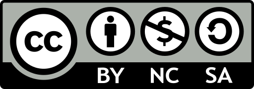

# IWB - Input Weather Barometer
This is a Weather Sensor measuring Atmospheric **Temperature** and Barometric **Pressure**
| Specifications | |
| --: | :--: |
| Communication | I²C |
| I²C Address | 0x77 |
| ChipSet | Goertek SPL06-001 |
| Datasheet | [.pdf](https://datasheet.lcsc.com/szlcsc/2101201914_Goertek-SPL06-001_C2684428.pdf) |
| Suggested Arduino Library | [GitHub](https://github.com/rv701/SPL06-007) |
|Suggested MicroPython Library|[GitHub](https://github.com/ChangboBro/SPL06-MEMS-barometer-micropython)|
| Temperature Accuracy | ± 0.5 °C |
| Temperature Range | -40 to +85°C |
| Pressure Accuracy | ± 6 Pa |
| Pressure Range | 300 to 1100 hPa|

## Supported I²C Modes - Unknown
- [X] 100 kbit/s Standard Mode (SM) 
- [X] 400 kbit/s	Fast Mode	FM
- [X] 1 Mbit/s	Fast Mode Plus	FM+
- [X] 3.4Mbit/s	High Speed Mode	HS
- [ ] 5 Mbit/s	Ultra Fast Mode	UFM

## Using the suggested library *https://github.com/rv701/SPL06-007* 

- Download the .zip file under the green `Code` button on the GitHub page
- Install the .zip file using Arduino's install .zip library

- Any other way, and you don't get the latest version!
- Initialize the library using `SPL_init(0x77);`

# License: 

Creative Commons Attribution-NonCommercial-ShareAlike 4.0 International Public License

[View License Deed](https://creativecommons.org/licenses/by-nc-sa/4.0/) | [View Legal Code](https://creativecommons.org/licenses/by-nc-sa/4.0/legalcode)
